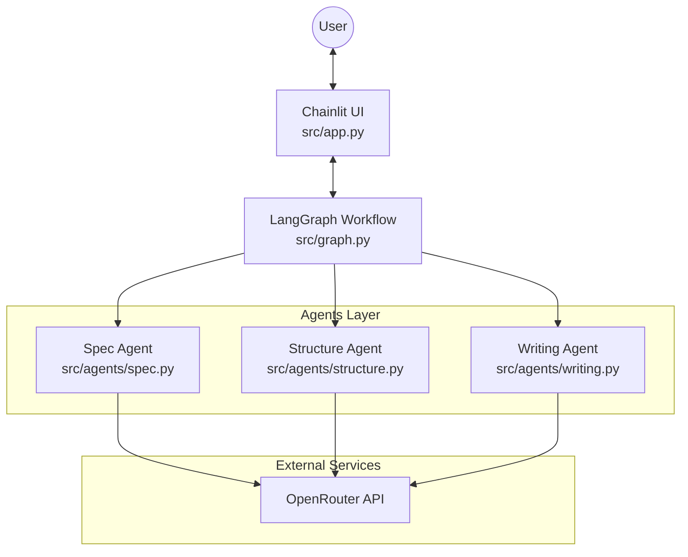

# 基本設計書: MABG (Multi-Agent Blog Generator)

本設計書は、`docs/requirements.md` および `docs/tech_stack.md` に基づき、システムのアーキテクチャと各要件の実装箇所を定義する。

## 1. システムアーキテクチャ

本システムは、**Chainlit** をUIサーバーとし、**LangGraph** を用いてステート管理とエージェント制御を行うアーキテクチャを採用する。LLMプロバイダとして **OpenRouter** を使用する。

### 1.1 コンポーネント構成図



## 2. ディレクトリ構成と責務

```text
.
├── docs/                   # ドキュメント (要件定義, 設計書)
├── src/
│   ├── app.py              # [UI] Chainlitエントリーポイント。画面描画、ユーザー入力ハンドリング。
│   ├── graph.py            # [Orchestration] LangGraphの状態遷移定義、ノード/エッジ構成。
│   ├── state.py            # [State] グラフ内で共有される状態 (State) の型定義。
│   ├── agents/             # [Agents] 各フェーズを担当するエージェントの実装。
│   │   ├── base.py         # エージェント共通基底クラス/関数 (LLM初期化など)。
│   │   ├── spec.py         # 仕様策定エージェント。
│   │   ├── structure.py    # 構成作成エージェント。
│   │   └── writing.py      # 記事執筆エージェント。
│   └── utils/              # ユーティリティ。
├── .env                    # 環境変数 (OPENAI_API_KEY 等)
├── docker-compose.yml      # コンテナ構成
├── Dockerfile              # アプリケーションイメージ定義
└── pyproject.toml          # 依存関係定義 (uv)
```

## 3. 要件と実装箇所の対応 (Traceability Matrix)

`docs/requirements.md` で定義された各機能要件の実装予定箇所を以下に示す。

### 3.1 ワークフロー制御

| 要件ID | 要件名称 | 実装ファイル | 実装詳細 / 関数名(案) |
| :--- | :--- | :--- | :--- |
| **REQ-FUN-001** | セッション開始 | `src/app.py` | `@cl.on_chat_start`<br>アプリ起動時の初期化、Welcomeメッセージ表示。<br>`workflow = compile_graph()` でグラフを初期化。 |

### 3.2 フェーズ1: 仕様書作成 (Spec Agent)

| 要件ID | 要件名称 | 実装ファイル | 実装詳細 / 関数名(案) |
| :--- | :--- | :--- | :--- |
| **REQ-FUN-010** | トピック入力 | `src/app.py` | `@cl.on_message`<br>初期状態(`START`)でのユーザー入力をトピックとしてStateに保存。 |
| **REQ-FUN-011** | 仕様案の提示 | `src/agents/spec.py` | `generate_spec_node(state)`<br>LLM (OpenRouter) を呼び出し仕様書Markdownを生成。State更新。 |
| **REQ-FUN-012** | 仕様の承認アクション | `src/app.py` <br> `src/graph.py` | `src/app.py`: `cl.Action` (Approve/Reject) を表示。<br>`src/graph.py`: 条件付きエッジ `check_approval` で分岐。<br>Reject時は `src/agents/spec.py` の `refine_spec_node` へ遷移。 |

### 3.3 フェーズ2: 構成作成 (Structure Agent)

| 要件ID | 要件名称 | 実装ファイル | 実装詳細 / 関数名(案) |
| :--- | :--- | :--- | :--- |
| **REQ-FUN-020** | 構成案の生成 | `src/agents/structure.py` | `generate_structure_node(state)`<br>仕様書(specDoc)を入力として構成案を生成。 |
| **REQ-FUN-021** | 構成の承認アクション | `src/app.py` <br> `src/graph.py` | 仕様フェーズと同様のAction/Edgeロジックを再利用または専用実装。 |

### 3.4 フェーズ3: 記事執筆 (Writing Agent)

| 要件ID | 要件名称 | 実装ファイル | 実装詳細 / 関数名(案) |
| :--- | :--- | :--- | :--- |
| **REQ-FUN-030** | 記事本文の執筆 | `src/agents/writing.py` | `write_article_node(state)`<br>構成案(structureDoc)を入力として全文執筆。 |
| **REQ-FUN-031** | 最終確認 | `src/app.py` | 最終成果物をMarkdown表示。コピー機能はChainlit標準のコードブロック機能を活用。 |

### 3.5 非機能要件・その他

| 要件ID | 要件名称 | 実装ファイル | 実装詳細 |
| :--- | :--- | :--- | :--- |
| **UI** | Thinking Process | `src/app.py` | `cl.Step` または `LangChainCallbackHandler` を用いて、エージェント実行中のステータスを表示。 |
| **REQ-PER-001** | ローカルレスポンス | `src/app.py` | `async` / `await` を徹底し、UIのスレッドをブロックしない実装とする。 |
| **REQ-MNT-001** | コードの簡潔性 | 全体 | LangGraphを採用することで、制御ロジック(`graph.py`)とビジネスロジック(`agents/`)を分離し、可読性を高める。 |

## 4. 技術スタック詳細設定

`docs/tech_stack.md` に基づく設定方針。

- **LLM Provider**: OpenRouter
    - `langchain_openai.ChatOpenAI` クラスを使用。
    - `openai_api_base` を `https://openrouter.ai/api/v1` に設定。
    - モデル名は `model_name` 引数で指定 (例: `openai/gpt-4o`, `anthropic/claude-3.5-sonnet` 等、OpenRouterの形式に従う)。
    - 環境変数 `OPENAI_API_KEY` に OpenRouter のキーを設定するか、`OPENROUTER_API_KEY` を読み込んで `api_key` 引数に渡す実装とする。

- **State Management**: LangGraph
    - `TypedDict` を継承した `BlogSessionState` を定義 (`src/state.py`)。
    - データの永続化は行わず、`MemorySaver` (インメモリ) を使用するか、Chainlitのセッションスコープでグラフインスタンスを保持する。
