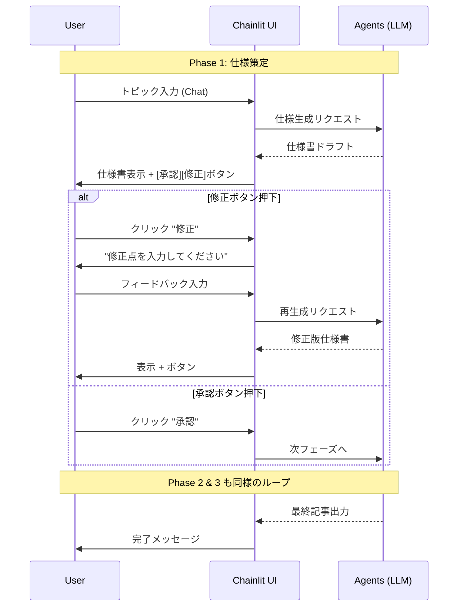

# ソフトウェア要求仕様書: MABG (Multi-Agent Blog Generator)

## 1\. はじめに

### 1.1 目的 (Purpose)

本文書は、ローカル環境で動作する「Multi-Agent Blog Generator (MABG)」の要求仕様を規定する。本システムは、**Chainlit**フレームワークを用いたチャットインターフェースを通じて、ユーザーと3つのAIエージェント（仕様・構成・執筆）が対話的に協調し、ブログ記事を作成することを目的とする。

### 1.2 範囲 (Scope)

  * **対象**: ユーザーのローカルマシン上でPythonスクリプトとして動作するWebアプリケーション。
  * **機能範囲**:
      * Chainlitを用いたチャットUIによる対話。
      * ステートレスな単発セッション（アプリ終了と共にデータ破棄）。
      * 3段階のエージェントワークフロー（仕様→構成→執筆）。
  * **除外事項**: ユーザー認証、データベースによる永続化、複数プロジェクトの同時管理。

### 1.3 定義・頭字語

  * **Chainlit**: Python製のLLMアプリケーション用UIフレームワーク。
  * **Session**: アプリ起動から終了（またはブラウザリロード）までの一連の操作単位。

## 2\. 全体説明

### 2.1 製品の展望 (Product Perspective)

本システムは、開発者が手元の端末で手軽にAIブログ執筆フローを実行するためのツールである。複雑なWebアプリ機能（ログイン等）を排除し、**「プロンプトと出力の往復」** に特化する。

### 2.2 ユーザー特性 (User Characteristics)

  * **開発者/テクニカルライター**: Python環境の構築が可能で、Docker の実行に慣れているユーザー。
  * **Chainlitの操作感**: チャットボット形式での対話操作を好む。

### 2.3 制約事項 (Constraints)

  * **実行環境**: Dockerがインストールされたローカル環境。
  * **UIフレームワーク**: Chainlitの標準機能（Message, Action, AskUserMessage等）の範囲内でUIを構築する。

## 3\. 具体的な要求事項 (Specific Requirements)

### 3.1 機能要件 (Functional Requirements)

#### 3.1.1 ワークフロー制御 (Chainlit Session)

  * **[REQ-FUN-001] セッション開始**
      * 概要: アプリケーションの起動。
      * 要件: システムは `docker compose up` コマンド等で起動し、ブラウザ上でチャット画面を表示しなければならない。
      * 要件: 起動直後にウェルカムメッセージを表示し、トピックの入力を促さなければならない。

#### 3.1.2 フェーズ1: 仕様書作成 (Spec Agent)

  * **[REQ-FUN-010] トピック入力**
      * 概要: ユーザーからの初期入力。
      * 要件: システムはチャット入力欄を通じて、ユーザーから記事のテーマを受け付けなければならない。
  * **[REQ-FUN-011] 仕様案の提示**
      * 概要: AIによるドラフト生成。
      * 要件: システムはLLMを用いて記事仕様書（ターゲット、SEO KW、ゴール等）を生成し、Markdown形式でチャット上に表示しなければならない。
  * **[REQ-FUN-012] 仕様の承認アクション**
      * 概要: Chainlit Actionを用いた承認フロー。
      * 要件: 仕様書の表示直後に、「承認 (Approve)」および「修正 (Reject/Feedback)」のボタン（Action）を表示しなければならない。
      * 要件: 「修正」が押された場合、次のチャット入力待ち状態となり、ユーザーのフィードバックを受け付けて再生成を行わなければならない。

#### 3.1.3 フェーズ2: 構成作成 (Structure Agent)

  * **[REQ-FUN-020] 構成案の生成**
      * 概要: 承認済み仕様書に基づく構成作成。
      * 要件: システムは仕様書の内容に基づき、記事の見出し構成（H1, H2, H3）を生成し表示しなければならない。
  * **[REQ-FUN-021] 構成の承認アクション**
      * 概要: 構成に対する承認フロー。
      * 要件: [REQ-FUN-012]と同様に「承認」「修正」のアクションボタンを提供し、フィードバックループを実装しなければならない。

#### 3.1.4 フェーズ3: 記事執筆 (Writing Agent)

  * **[REQ-FUN-030] 記事本文の執筆**
      * 概要: 最終コンテンツの生成。
      * 要件: システムは構成案に従って記事本文を執筆し、Markdownとしてレンダリング表示しなければならない。
  * **[REQ-FUN-031] 最終確認**
      * 概要: 成果物の確定。
      * 要件: 執筆結果に対しても「承認」「修正」のフローを提供しなければならない。
      * 要件: 最終承認された時点で、「記事作成が完了しました」というメッセージと共に、テキストコピー可能な形式で最終稿を表示しなければならない。

### 3.2 外部インターフェース要件

  * **UI (Chainlit)**:
      * **Thinking Process**: エージェントが思考中であることを示すため、Chainlitの `cl.Step` または `cl.Message` のローディング表示を使用すること。
      * **Markdown表示**: 仕様書や記事はMarkdownとして綺麗にフォーマットされ、見出しや箇条書きが視認しやすくなっていなければならない。

### 3.3 品質要件 (Quality Requirements)

  * **[REQ-PER-001] ローカルレスポンス**: UI操作（ボタン押下等）に対する反応は即座（0.1秒以内）であること。LLMの生成待ちは外部API依存とする。
  * **[REQ-MNT-001] コードの簡潔性**: ロジックは可能な限り `app.py` などの少数のファイルに集約し、ローカルでの変更・拡張を容易にすること。

## 4\. 検証基準 (Verification Criteria)

1.  `docker compose up` でエラーなく起動すること。
2.  トピック入力後、仕様書案がチャットに返ってくること。
3.  「修正」ボタンを押し、フィードバックを入力すると、内容が反映された修正案が再提示されること。
4.  最終的に生成された記事がMarkdownとして正しく表示されること。

## 5\. 付録: Mermaid Workflow

Chainlit上でのインタラクションフローを示します。

## 6\. 形式手法 (Formal Methods)

Z記法を用いて、各フェーズにおける状態遷移とデータの不変条件（Invariant）を定義する。

### 6.1 状態空間の定義

$$
\begin{array}{|l|}
\hline
\textbf{BlogSessionState} \\
\hline
phase: \{ \text{Spec}, \text{Structure}, \text{Writing}, \text{Done} \} \\
topic: \text{TEXT} \\
specDoc: \text{DOCUMENT} \\
structureDoc: \text{DOCUMENT} \\
finalArticle: \text{DOCUMENT} \\
feedback: \text{TEXT} \\
\hline
\text{invariant: } \\
\quad phase = \text{Structure} \implies specDoc \neq \varnothing \\
\quad phase = \text{Writing} \implies structureDoc \neq \varnothing \\
\quad phase = \text{Done} \implies finalArticle \neq \varnothing \\
\hline
\end{array}
$$

### 6.2 状態遷移操作：承認 (Approve)

$$
\begin{array}{|l|}
\hline
\textbf{ApproveTransition} \\
\hline
\Delta \text{BlogSessionState} \\
\hline
phase = \text{Spec} \implies (phase' = \text{Structure} \land specDoc' = specDoc) \\
phase = \text{Structure} \implies (phase' = \text{Writing} \land structureDoc' = structureDoc) \\
phase = \text{Writing} \implies (phase' = \text{Done} \land finalArticle' = finalArticle) \\
feedback' = \varnothing \\
\hline
\end{array}
$$

### 6.3 状態遷移操作：修正 (Reject & Feedback)

$$
\begin{array}{|l|}
\hline
\textbf{RejectTransition} \\
\hline
\Delta \text{BlogSessionState} \\
inFeedback?: \text{TEXT} \\
\hline
inFeedback? \neq \varnothing \\
phase' = phase \\
feedback' = inFeedback? \\
phase = \text{Spec} \implies specDoc' = \text{regenerate}(specDoc, inFeedback?) \\
phase = \text{Structure} \implies structureDoc' = \text{regenerate}(structureDoc, inFeedback?) \\
\hline
\end{array}
$$
